# Made in India D2C Brand Investigator

Many D2C brands claim to manufacture products in India but are actually importing products from China with minimal customization. This project provides a systematic approach to investigate whether D2C brands are truly manufacturing in India or simply rebranding imported products.

## Inspiration

This project was inspired by [@shantanugoel's viral thread](https://x.com/shantanugoel/status/1935583692422090938?t=hMBnYW7Q7ErRSFrbFrT7dw&s=19) exposing how D2C brands market themselves as "Made in India" while actually importing products from China. The thread provided a manual methodology that we've now automated with AI.

## Background

After investigating electric toothbrush companies, we found that brands like:

- **Seven Oral Care**: Claims to be "dentist created and designed in India"
- **Perfora**: Funded by VCs including Shark Tank investors

Despite their claims, investigation revealed they are marketing companies mass-importing products from China rather than actual manufacturers.

## Investigation Methodology

### Step 1: Find the Registered Company Name

- Check the company's website for official registration details
- Search for founders on [ZaubaCorp](https://zaubacorp.com) using: `"<founder name> zauba"`
- **Examples found:**
  - Seven Oral Care → "SOC Wellness Private Limited"
  - Perfora → "Chipper Consumer Private Limited"

### Step 2: Research Import History

- Search for: `"<Company name> import history"` or `"<Company name> import records"`
- Key websites to check:
  - [Zauba.com](https://zauba.com) - Free access to limited import records
  - [Connect2India.com](https://connect2india.com)
  - [Seair.co.in](https://seair.co.in)
- Note: Most detailed data requires payment, but free records often provide sufficient evidence

### Step 3: Trace Product Sources

- Search for suppliers and products on B2B platforms:
  - [Alibaba.com](https://alibaba.com)
  - [AliExpress.com](https://aliexpress.com)
- Compare product specifications, model numbers, and features
- Look for customization options (color, shape, labeling, packaging)

**Key Finding Example:**

- Seven Oral Care's "Super Toothbrush" = Shenzhen Jinri Electrical Appliance Co's T11 model
- Seven's junior toothbrush = Variant of Seago Electric Co's SG-2139 kids toothbrush

### Step 4: Verify Company Capabilities (Optional)

- Analyze employee profiles on LinkedIn
- Look for actual technical roles:
  - Engineers
  - Product designers
  - R&D specialists
- Check job postings history for technical vs. marketing roles

**Analysis Results:**

- **Seven Oral Care**: No engineers employed, primarily hires social media managers
- **Perfora**: No visible engineering team, some junior doctors on staff

## Red Flags to Watch For

1. **Marketing-heavy teams** with no technical staff
2. **"Country of Origin: China"** labels on e-commerce platforms
3. **Identical product specifications** to Alibaba listings
4. **Import records** showing finished products rather than raw materials
5. **Discrepancies** between brand story and actual business operations

## Tools

- **AI-Enhanced Investigation Platform**: `index.html` + `app.js` - Web-based tool using Serper, Gemini, and Firecrawl APIs
- **Manual Research**: Corporate databases and B2B platforms

## System Architecture

### C2 - Container Diagram: System Overview

```mermaid
graph TB
    User[👤 User]
    Browser[🌐 Browser<br/>Single Page Application]
    SerperAPI[🔍 Serper API<br/>Search Service]
    GeminiAPI[🧠 Gemini API<br/>LLM Service]
    FirecrawlAPI[🕷️ Firecrawl API<br/>Web Scraping Service]
    LocalStorage[💾 Local Storage<br/>API Keys & Cache]

    User -->|"Inputs brand data"| Browser
    Browser -->|"Search queries"| SerperAPI
    Browser -->|"AI analysis requests"| GeminiAPI
    Browser -->|"Content parsing requests"| FirecrawlAPI
    Browser -->|"Store/retrieve keys"| LocalStorage

    SerperAPI -->|"Search results"| Browser
    GeminiAPI -->|"AI insights & validation"| Browser
    FirecrawlAPI -->|"Parsed content"| Browser
    Browser -->|"Investigation report"| User

    classDef userClass fill:#e1f5fe
    classDef browserClass fill:#f3e5f5
    classDef apiClass fill:#e8f5e8
    classDef storageClass fill:#fff3e0

    class User userClass
    class Browser browserClass
    class SerperAPI,GeminiAPI,FirecrawlAPI apiClass
    class LocalStorage storageClass
```

### C3 - Component Diagram: Browser Application Architecture

```mermaid
graph TB
    subgraph "Browser Application Components"
        UI[🎨 UI Components<br/>- Input Forms<br/>- Progress Tracker<br/>- Results Display]

        InvestigationEngine[🔍 Investigation Engine<br/>- Workflow Orchestration<br/>- Step Management<br/>- Progress Tracking]

        AIEngine[🧠 AI Analysis Engine<br/>- Input Validation<br/>- Result Analysis<br/>- Report Generation]

        APIClients[📡 API Clients<br/>- Serper Client<br/>- Gemini Client<br/>- Firecrawl Client]

        DataProcessor[⚙️ Data Processor<br/>- Result Parsing<br/>- Insight Extraction<br/>- Cross-correlation]

        StateManager[📊 State Manager<br/>- Investigation Data<br/>- API Key Storage<br/>- Session Management]
    end

    UI -->|"User interactions"| InvestigationEngine
    InvestigationEngine -->|"Validate inputs"| AIEngine
    InvestigationEngine -->|"Execute searches"| APIClients
    APIClients -->|"Raw results"| DataProcessor
    DataProcessor -->|"Processed data"| AIEngine
    AIEngine -->|"AI insights"| DataProcessor
    DataProcessor -->|"Final results"| UI
    InvestigationEngine <-->|"Store/retrieve state"| StateManager
    AIEngine <-->|"Access configuration"| StateManager

    classDef uiClass fill:#e3f2fd
    classDef engineClass fill:#f1f8e9
    classDef dataClass fill:#fff8e1
    classDef apiClass fill:#fce4ec

    class UI uiClass
    class InvestigationEngine,AIEngine engineClass
    class DataProcessor,StateManager dataClass
    class APIClients apiClass
```

### AI-Enhanced Investigation Flow

```mermaid
sequenceDiagram
    participant U as 👤 User
    participant UI as 🎨 UI
    participant IE as 🔍 Investigation Engine
    participant AI as 🧠 AI Engine
    participant API as 📡 API Clients
    participant DP as ⚙️ Data Processor

    U->>UI: Input brand name & category
    UI->>IE: Start investigation
    IE->>AI: Validate inputs with LLM

    Note over AI: Gemini analyzes:<br/>- Brand name validity<br/>- Category appropriateness<br/>- Industry context

    AI-->>IE: Validation results + enhanced search terms

    loop For each investigation step
        IE->>API: Execute search query
        API-->>DP: Raw search results

        alt If Firecrawl available
            API->>API: Parse content with Firecrawl
            API-->>DP: Enhanced content
        end

        DP->>AI: Analyze results with LLM

        Note over AI: Gemini extracts:<br/>- Key findings<br/>- Red flags<br/>- Confidence scores<br/>- Business intelligence

        AI-->>DP: AI analysis results
        DP->>UI: Display step results
    end

    IE->>AI: Generate final report with LLM

    Note over AI: Gemini synthesizes:<br/>- Overall risk assessment<br/>- Manufacturing likelihood<br/>- Executive summary<br/>- Recommendations

    AI-->>UI: Final investigation report
    UI->>U: Present comprehensive findings
```

## AI Integration Details

### LLM Capabilities (Gemini)

1. **Input Validation**

   - Validates brand name format and legitimacy
   - Assesses product category specificity
   - Provides industry context and search optimization
   - Suggests enhanced search terms

2. **Search Result Analysis**

   - Extracts key business intelligence from search results
   - Identifies red flags indicating import operations
   - Detects positive indicators of genuine manufacturing
   - Assigns confidence scores to findings

3. **Cross-Correlation Analysis**

   - Connects findings across different investigation steps
   - Identifies patterns and inconsistencies
   - Builds comprehensive business profile

4. **Final Report Generation**
   - Synthesizes all findings into executive summary
   - Calculates overall risk assessment
   - Provides manufacturing likelihood percentage
   - Generates actionable recommendations

### Enhanced Data Processing (Firecrawl)

- **Deep Content Parsing**: Extracts structured data from corporate websites
- **Import Record Analysis**: Parses complex trade data documents
- **LinkedIn Profile Extraction**: Analyzes team composition and capabilities
- **Supplier Website Analysis**: Identifies OEM/ODM relationships

## 🚀 Coming Soon

- **Batch Investigation**: Analyze multiple brands simultaneously
- **Chrome Extension**: One-click investigation while browsing D2C websites
- **Public Database**: Searchable database of investigation results
- **Advanced Analytics**: Trend analysis and industry insights
- **API Access**: Programmatic access to investigation capabilities
- **Community Features**: User-submitted investigations and verification
- **Mobile App**: Native mobile investigation platform

---

_This AI-enhanced investigation platform provides professional-grade business intelligence to help consumers and investors make informed decisions about D2C brand authenticity._
